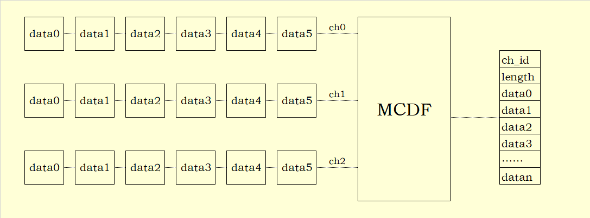
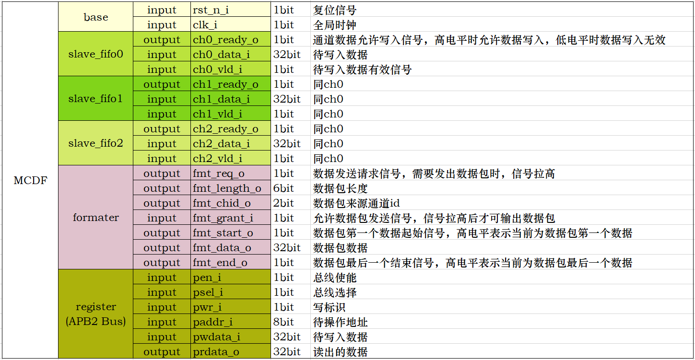
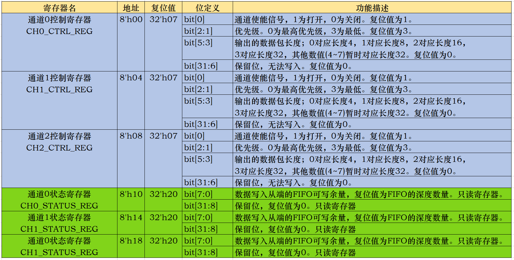
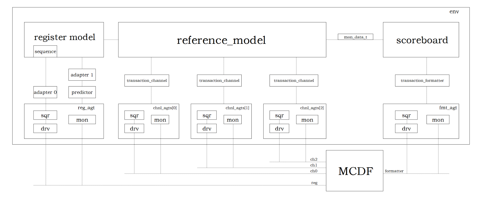
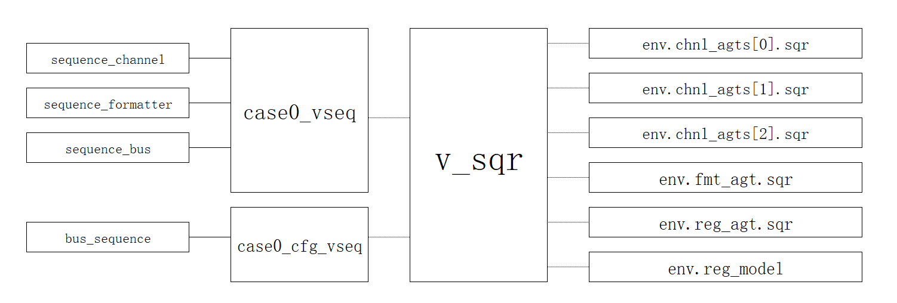

# uvm-mcdf

#### 介绍
取自路科验证V2Pro-UVM入门进阶实验lab5源码

#### 软件架构
    uvm-mcdf/
    ├── doc
    │   └── uvm_mcdf_env.xlsx
    ├── dut
    │   ├── arbiter.v
    │   ├── formater.v
    │   ├── mcdf.v
    │   ├── param_def.v
    │   ├── reg.v
    │   └── slave_fifo.v
    ├── sim
    │   ├── Makefile
    │   └── rtl.list
    └── testbench
        ├── component
        │   ├── agent
        │   │   ├── agent_bus.sv
        │   │   ├── agent_channel.sv
        │   │   └── agent_formater.sv
        │   ├── case
        │   │   ├── base_test.sv
        │   │   ├── case0.sv
        │   │   ├── case1.sv
        │   │   ├── case2.sv
        │   │   └── sequence.sv
        │   ├── coverage
        │   │   └── coverage_pkg.sv
        │   ├── driver
        │   │   ├── driver_bus.sv
        │   │   ├── driver_channel.sv
        │   │   └── driver_formater.sv
        │   ├── env
        │   │   └── env.sv
        │   ├── model
        │   │   └── model.sv
        │   ├── monitor
        │   │   ├── monitor_bus.sv
        │   │   ├── monitor_channel.sv
        │   │   └── monitor_formater.sv
        │   ├── register
        │   │   ├── adapter.sv
        │   │   └── reg_model.sv
        │   ├── scoreboard
        │   │   └── scoreboard.sv
        │   ├── sequencer
        │   │   └── sequencer_pkg.sv
        │   └── transaction
        │       ├── transaction_bus.sv
        │       ├── transaction_channel.sv
        │       └── transaction_formater.sv
        ├── interface
        │   └── interface.sv
        └── tb_top.sv

#### 安装教程

1.  开发环境搭建参考：[UVM学习之路（1）— CentOS 7虚拟机下安装VCS开发环境](https://blog.csdn.net/qq_38113006/article/details/120803926)
2.  开发工具使用参考：[UVM学习之路（2）— 使用VCS+Verdi进行仿真调试](https://blog.csdn.net/qq_38113006/article/details/120921003)
3.  开发环境使用说明：[UVM学习之路（3）— 基于UVM的第一个Hello程序](https://blog.csdn.net/qq_38113006/article/details/120924689)
4.	本仓库的代码说明：[UVM学习之路（6）— 基于MCDF的验证平台](https://blog.csdn.net/qq_38113006/article/details/122904135)

#### 设计描述

1. 功能概览

   

2. 信号列表

   

3. 寄存器列表

   

#### 验证环境

#### 特技

1.  使用 Readme\_XXX.md 来支持不同的语言，例如 Readme\_en.md, Readme\_zh.md
2.  Gitee 官方博客 [blog.gitee.com](https://blog.gitee.com)
3.  你可以 [https://gitee.com/explore](https://gitee.com/explore) 这个地址来了解 Gitee 上的优秀开源项目
4.  [GVP](https://gitee.com/gvp) 全称是 Gitee 最有价值开源项目，是综合评定出的优秀开源项目
5.  Gitee 官方提供的使用手册 [https://gitee.com/help](https://gitee.com/help)
6.  Gitee 封面人物是一档用来展示 Gitee 会员风采的栏目 [https://gitee.com/gitee-stars/](https://gitee.com/gitee-stars/)
